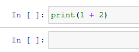

# NBFormat

A simple package to add [JuliaFormatter](https://github.com/domluna/JuliaFormatter.jl) autoformatting support to Jupyter notebooks running on [IJulia.](https://github.com/JuliaLang/IJulia.jl)  Inspired by my favorite Jupyter extension, [nb_black.](https://github.com/dnanhkhoa/nb_black)

## Usage

In your notebook,
```julia
using NBFormat
enable_autoformat()
```

Afterwards, whenever you run a cell, it will automatically be formatted.  If you want
to turn off auto-formatting, run
```
disable_autoformat()
```

## Jupyter Notebook and Lab Compatibility
While this package works with both legacy Jupyter Notebooks and Jupyter Lab, it does have some issues in Jupyter Notebooks.  **On legacy notebooks only**, when a cell is formatted its output will be suppressed and it will lose its `In[]` and `Out[]`.  This will only happen if the cell is not already formatted properly.  

For example, running this already-formatted cell will output as normal:


However, running this unformatted cell will not print properly; running this cell


Results in this formatted cell with no output


It is recommended that you run in Jupyter Lab if possible, since it does not have this issue.